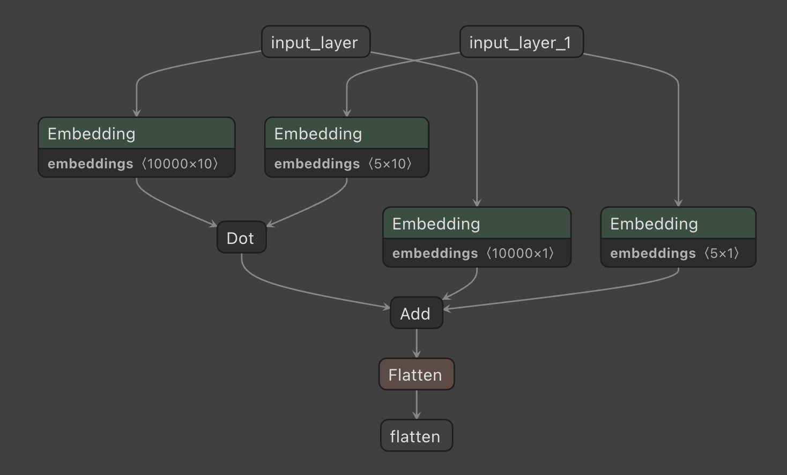

[](https://github.com/giobbu/neural-MF/actions/workflows/unit-tests.yml)
# Neural Matrix Factorization
Basic matrix factorization with Keras for missing data imputation.

## Missingness types
### Block-wise


### Point-wise


## Model Architecture with Netron
Inspect model structure after saving in [Netron](https://netron.app/)



## Debugging and experimentation with Tensorboard
Visualization for neural-MF experimentation in [Tensorboard](https://www.tensorflow.org/tensorboard):

```bash
tensorboard --logdir /path/to/logs/directory
```

